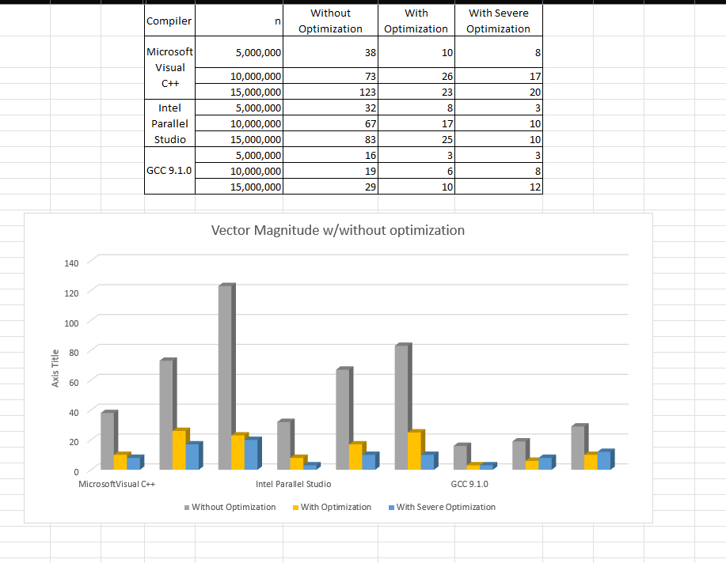

# This was done while learning parallel programming topic

## Indeed different compiler will result in different execution time on the same task

## Also the with different levels of optimization, even the same compiler will cause different run time

## setting up notes for Visual C++ in Visual Studio 2022.

!!!MS Visual C++ !!!! if you have this error code while adjust compiler **optimization level
Severity	Code	Description	Project	File	Line	Suppression State
Error	D8016	'/Ox' and '/RTC1' command-line options are incompatible**

Solution:
Temporarily disbale the run time type checking.
right click project -> properties -> C/C++ -> Code generation -> Basic Runtime Checks -> Default

## where to find all the pre-defined compiler macros?

<https://sourceforge.net/p/predef/wiki/Compilers/>
