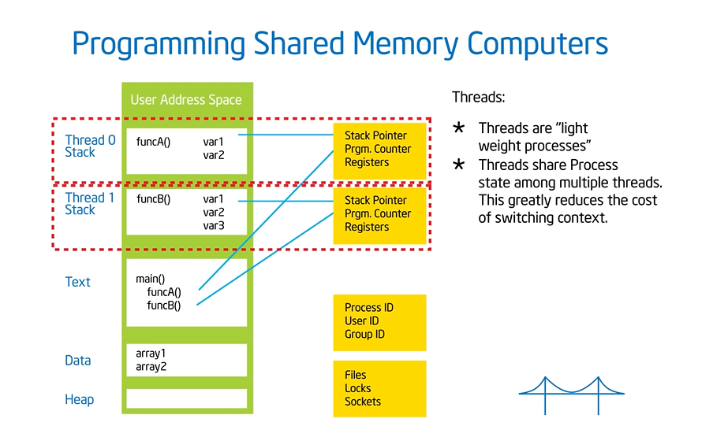
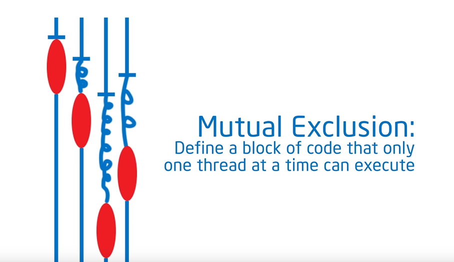

# OpenMP learning from the Tim Mattson

Vid link: <https://www.youtube.com/watch?v=nE-xN4Bf8XI&list=PLLX-Q6B8xqZ8n8bwjGdzBJ25X2utwnoEG&index=1>

## Concurrency

A condition of a system in which multiple tasks are logically active at one time.


Nothing happened at the same time, the CPU switching between tasks quickly. It looks like it is running at the same time.

## Parallelism(A subset of Concurrency)

A condition of a system in which multiple tasks are actually active at one time.


So the relationship between Parallelism and Concurrency looks like this:


## concurrent applications

An application for which computations logically execute simultaneously due to the semantics of the application.

## Parallel applications

An application for which computations actually execute simultaneously in order to complete a problem in less time.

## Brief Intro on OpenMP

This is an API for writing multithreaded application.

A set of compiler directives and library routines for parallel application programmers.

Works with Fortran, C, C++.

## Solution Stack

Programming layer


## Syntax of Open MP

Most of the constructs in Open MP are compiler directives.

Most OpenMP constructs apply to a "Structured Block".

Structured Blocks:

A block of one or more statements with *one point of entry* at the top and *one point of exit* at the bottom.

The syntax is like

```c++

#include <omp.h> 


#pragma omp construct [clause[clause]...]

// example

#pragma omp parallel num_threads(4)

```

## Shared Memory Computer

Any computer composed of multiple processing elements that share an address space. There are two classes:

Symmetric multiprocessor(SMP)

A shared address space with "equal-time" access for each processor and the OS treats every processor the same way.

NUMA Non uniform address space multiprocessor:

Different memory regions have different accessing costs.

There is a difference between reaching far memory and near memory.


The modern CPUs are not 100% SMP, and coders need to keep this in minds.

## Programming shared memory computers



Each thread has its own private stack.

But all threads they are sharing the Text, Data, and Heap.

A block of threads are sharing a process, but communication between the threads are fairly cheap because of the shared context.


## Fork Join Parallelism


You can nest this pattern in the sub program as well


## Open MP tells the compiler to generate a func do parallel with pthreads

Open MP actually hides the details and complexity of the pthread.


## False sharing


## Sync

1. Barrier:

Each thread wait at the barrier until all threads arrive.


2. Mutual Exclusion:

Define a block of code that only one thread at a time can execute.
(Think about SQL transactions)



There are more sync tools, but we will only focus on these two now.

